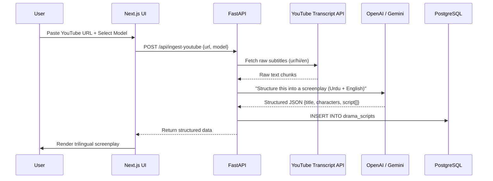
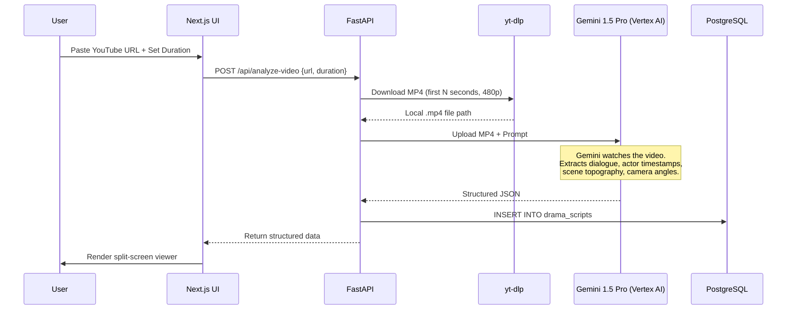

# Architecture — AK Productions Studio OS

This document provides a deep technical dive into the system architecture of AK Productions for hackathon judges, investors, and technical reviewers.

---

## System Overview

AK Productions follows a **hub-and-spoke agent architecture**. The FastAPI backend acts as the central API Gateway (hub), and each AI agent operates as an independent module (spoke) with its own prompt engineering, data pipeline, and external API integrations.

All agents share a single **PostgreSQL knowledge base**, enabling cross-agent data sharing. For example, the Data Ingestion Agent saves structured screenplays to the database, and the Acting Coach Agent can later query those same screenplays to compare an actor's live performance against the written dialogue.

```
┌─────────────────────────────────────────────────────┐
│                   CLIENT LAYER                       │
│                                                     │
│   ┌───────────────┐       ┌───────────────────┐    │
│   │  Next.js Web  │       │  Expo React Native│    │
│   │  Dashboard    │       │  Mobile App       │    │
│   └───────┬───────┘       └────────┬──────────┘    │
│           │         REST           │                │
└───────────┼────────────────────────┼────────────────┘
            │                        │
            ▼                        ▼
┌─────────────────────────────────────────────────────┐
│                 API GATEWAY (FastAPI)                 │
│                                                     │
│  /api/ingest-youtube    POST   → Data Ingestion     │
│  /api/analyze-video     POST   → Gemini Multimodal  │
│  /api/library           GET    → Script Library     │
│  /api/library/{id}      GET    → Single Script      │
│  /api/discover-ip       POST   → IP Discovery       │
│  /api/script-breakdown  POST   → Script Breakdown   │
│  /api/analyze-perf.     POST   → Acting Coach       │
│  /api/check-continuity  POST   → Continuity Agent   │
│  /api/auto-dub          POST   → Auto-Dubbing       │
│  /api/projects          CRUD   → Project Management │
│                                                     │
└───────────────────┬─────────────────────────────────┘
                    │
        ┌───────────┼───────────┐
        ▼           ▼           ▼
┌──────────┐ ┌──────────┐ ┌──────────────────┐
│PostgreSQL│ │  OpenAI  │ │ Gemini 1.5 Pro   │
│ Database │ │ GPT-4o-  │ │ (Vertex AI /     │
│          │ │ mini     │ │  GCP)            │
└──────────┘ └──────────┘ └──────────────────┘
```

---

## Data Flow: YouTube → Screenplay

The most complex data flow in the system is the YouTube ingestion pipeline. Here is the full sequence:

### Fast Transcript Extraction (Text-only)



### Deep Video Analysis (Multimodal)



---

## Database Schema

```sql
-- Core production projects
CREATE TABLE projects (
    id          SERIAL PRIMARY KEY,
    title       VARCHAR NOT NULL,
    description TEXT,
    status      VARCHAR DEFAULT 'In Development',
    created_at  TIMESTAMP DEFAULT NOW()
);

-- Uploaded scripts (PDFs)
CREATE TABLE scripts (
    id          SERIAL PRIMARY KEY,
    project_id  INTEGER REFERENCES projects(id),
    filename    VARCHAR NOT NULL,
    content     TEXT,
    uploaded_at TIMESTAMP DEFAULT NOW()
);

-- AI agent activity logs
CREATE TABLE agent_logs (
    id          SERIAL PRIMARY KEY,
    project_id  INTEGER REFERENCES projects(id),
    agent_name  VARCHAR NOT NULL,
    action      VARCHAR NOT NULL,
    result_data TEXT,  -- JSON string
    created_at  TIMESTAMP DEFAULT NOW()
);

-- Extracted YouTube drama screenplays
CREATE TABLE drama_scripts (
    id                     SERIAL PRIMARY KEY,
    video_id               VARCHAR UNIQUE NOT NULL,
    title                  VARCHAR,
    scene_description      TEXT,
    characters_identified  VARCHAR,  -- comma-separated
    script_content         TEXT,     -- full JSON
    created_at             TIMESTAMP DEFAULT NOW()
);
```

---

## AI Model Strategy

AK Productions is **model-agnostic by design**. The UI exposes a toggle that lets the user choose which model powers each request.

| Model | Strengths | Used For |
|---|---|---|
| **OpenAI GPT-4o-mini** | Fast, cheap ($0.15/1M tokens), excellent JSON mode | Text-only transcript structuring, IP Discovery, Script Breakdown |
| **Google Gemini 1.5 Pro** | 1M token context, native video/audio understanding, JSON mode | Deep Video Analysis (multimodal), Acting Coach, Continuity |

The backend dynamically routes to the correct provider based on the `model` field in the API request body. Gemini authenticates via **Vertex AI** using the user's local GCP Application Default Credentials — no API key required.

---

## Frontend Architecture

The web dashboard is built on **Next.js 16** with the App Router. Each agent has its own route and page component:

```
src/app/
├── layout.tsx              # Root layout with Header + ThemeProvider
├── page.tsx                # Dashboard / Landing
├── data-ingestion/
│   └── page.tsx            # YouTube ingestion + config panel
├── library/
│   ├── page.tsx            # Searchable script library grid
│   └── [id]/
│       └── page.tsx        # Split-screen Studio Viewer
├── ip-discovery/page.tsx
├── acting-coach/page.tsx
├── script-breakdown/page.tsx
├── continuity-agent/page.tsx
├── auto-dubbing/page.tsx
└── pipeline/page.tsx       # Multi-step wizard
```

### Design System
- **Theme**: Monochrome enterprise aesthetic with Dark/Light mode (`next-themes`)
- **Typography**: System font stack for maximum performance
- **Animations**: Framer Motion for page transitions and micro-interactions
- **Responsive**: Full mobile responsiveness via Tailwind breakpoints

---

## Deployment Considerations

| Concern | Approach |
|---|---|
| **Video storage** | Temporary — downloaded videos are deleted after Gemini processes them |
| **API rate limits** | Gemini via Vertex AI uses project-level quotas; OpenAI respects per-key RPM |
| **Database scaling** | PostgreSQL handles millions of screenplay records; add read replicas for scale |
| **Authentication** | Currently single-user; add NextAuth.js for multi-tenant SaaS |
| **CI/CD** | Standard Next.js build + Python Docker container for backend |

---

<p align="center">
  <em>For the business narrative, market sizing, and competitive analysis, see <a href="./PITCH.md">PITCH.md</a>.</em>
</p>
