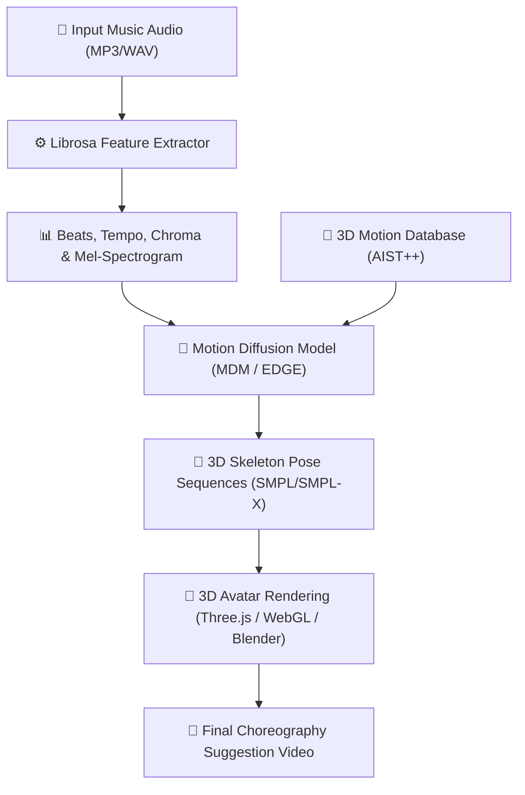

# 🕺 AI Music-to-Motion Dance Choreography (Design Proposal)

## 🎯 Objective
Enable **autonomous dance choreography generation and synthesis matching any music audio track** (even if completely different from the original choreography's soundtrack) using generative sequence-to-sequence models and motion diffusion.

---

## 🏗️ Technical Pipeline

### 1. Audio Feature Extraction & Analysis
* Process the input music track using **Librosa** or **Wav2Vec2** to extract:
  * **Temporal Features:** Beats, tempo (BPM), and onset strength.
  * **Spectral/Harmonic Features:** Mel-frequency cepstral coefficients (MFCCs), chroma vectors, and constant-Q transform (CQT).
* Match rhythm patterns to generate temporal anchors for key pose changes.

### 2. Generative Motion Diffusion Model
* Utilize **EDGE (Exemplar-based Dance Generation)** or **Bailando** architectures, trained on the **AIST++ 3D dance-music dataset**.
* The core generator is a transformer-based diffusion model conditioned on the extracted audio features.
* The model synthesizes frame-by-frame 3D joint rotations and coordinates, ensuring the motion:
  * Aligns closely with the beat (musical synchronization).
  * Has high physical plausibility (no sliding feet, natural joint limits).
  * Exhibits artistic style variation based on genre embedding (e.g., Hip-Hop, Contemporary, Salsa).

### 3. Motion Retargeting & 3D Web Rendering
* Output the generated sequences as standard skeletal structures (**SMPL/SMPL-X** body parameters).
* Use a web-based **Three.js** or **BabylonJS** renderer to load customized 3D human avatars and retarget the joint motion in real-time.
* Provide interactive camera control, speed settings (0.5x, 1x, 2x), and loop selectors on the choreographer dashboard.

---

## 💡 Practical Production Use Cases
* **Music Video Pre-Visualization:** Direct music videos and stage live shows with simulated virtual choreography matching newly produced tracks.
* **SaaS/App Choreography Assistant:** Assist dancers and content creators (e.g., TikTok/Reels) by auto-generating choreography drafts in seconds.
* **Game Development:** Auto-animate non-playable characters (NPCs) dancing dynamically to whatever in-game music is playing.
