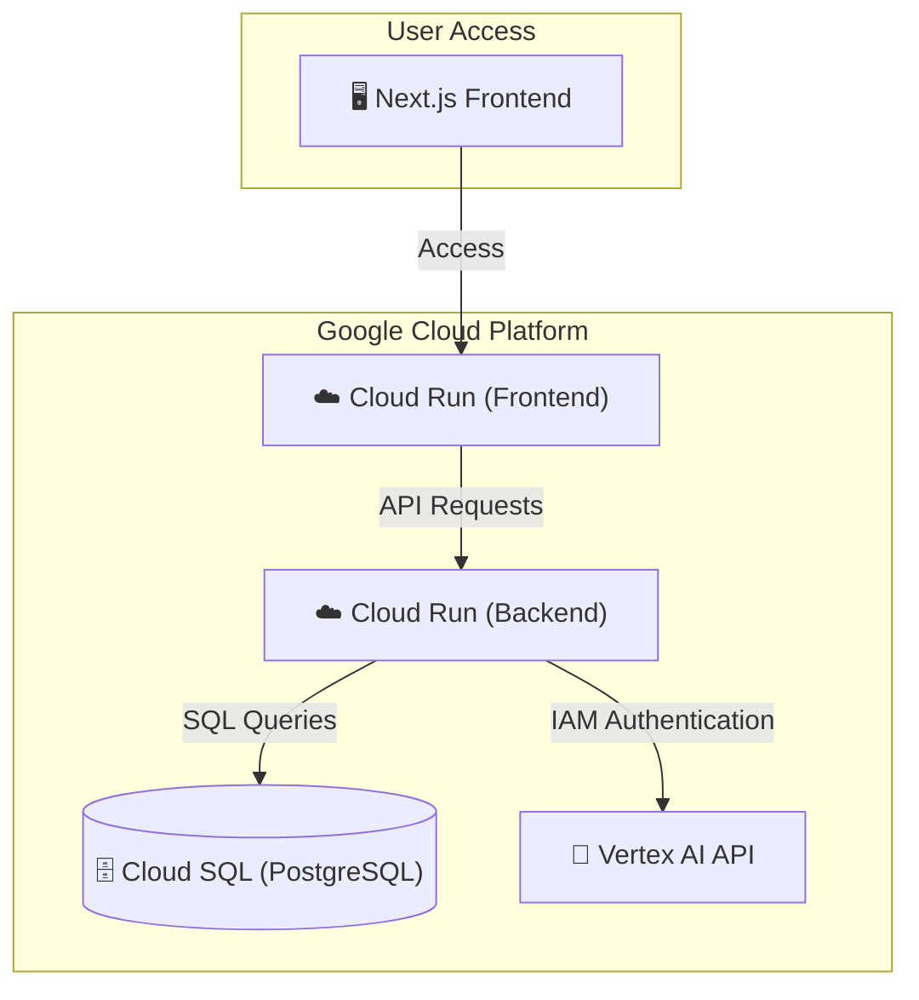

# 🚀 Google Cloud Platform (GCP) Deployment Plan

This guide outlines how to deploy **AK Productions Studio OS** entirely within the Google Cloud ecosystem (using Cloud Run, Cloud SQL, and Vertex AI).

---

## 🏗 Architecture Overview



---

## 📦 1. Containerizing the Apps

### Backend Dockerfile (`backend/Dockerfile`)
```dockerfile
FROM python:3.11-slim

WORKDIR /app

# Install system dependencies for yt-dlp & psycopg2
RUN apt-get update && apt-get install -y \
    build-essential \
    libpq-dev \
    ffmpeg \
    && rm -rf /var/lib/apt/lists/*

COPY requirements.txt .
RUN pip install --no-cache-dir -r requirements.txt

COPY . .

EXPOSE 8080

# Run FastAPI app with Uvicorn
CMD ["uvicorn", "main:app", "--host", "0.0.0.0", "--port", "8080"]
```

### Frontend Dockerfile (`frontend/Dockerfile`)
```dockerfile
FROM node:20-slim AS builder
WORKDIR /app
COPY package*.json ./
RUN npm install
COPY . .
RUN npm run build

FROM node:20-slim AS runner
WORKDIR /app
COPY --from=builder /app/package*.json ./
COPY --from=builder /app/.next ./.next
COPY --from=builder /app/public ./public
COPY --from=builder /app/node_modules ./node_modules
COPY --from=builder /app/next.config.ts ./next.config.ts

EXPOSE 3000
CMD ["npm", "run", "start"]
```

---

## 🗄️ 2. Setting Up Cloud SQL (PostgreSQL)

1. Create a PostgreSQL instance in Cloud SQL:
   ```bash
   gcloud sql instances create ak-productions-db \
       --database-version=POSTGRES_15 \
       --tier=db-f1-micro \
       --region=us-central1
   ```
2. Create a database and user:
   ```bash
   gcloud sql databases create ak_productions --instance=ak-productions-db
   gcloud sql users create postgres --instance=ak-productions-db --password=YOUR_SECURE_PASSWORD
   ```

---

## ☁️ 3. Deploying the Backend to Cloud Run

1. Build and push the backend container to Artifact Registry:
   ```bash
   gcloud builds submit --tag gcr.io/YOUR_PROJECT_ID/ak-productions-backend ./backend
   ```
2. Deploy to Cloud Run, linking it to the Cloud SQL instance:
   ```bash
   gcloud run deploy ak-productions-backend \
       --image gcr.io/YOUR_PROJECT_ID/ak-productions-backend \
       --platform managed \
       --region us-central1 \
       --allow-unauthenticated \
       --add-cloudsql-instances YOUR_PROJECT_ID:us-central1:ak-productions-db \
       --set-env-vars DATABASE_URL="postgresql://postgres:YOUR_PASSWORD@/ak_productions?host=/cloudsql/YOUR_PROJECT_ID:us-central1:ak-productions-db",OPENAI_API_KEY="sk-your-key"
   ```

### 🔑 IAM Permissions for Vertex AI
Since the backend runs on Cloud Run, it can authenticate with Vertex AI seamlessly using the default service account.
1. Grant the Cloud Run service account the **Vertex AI User** role:
   ```bash
   gcloud projects add-iam-policy-binding YOUR_PROJECT_ID \
       --member="serviceAccount:YOUR_PROJECT_NUMBER-compute@developer.gserviceaccount.com" \
       --role="roles/aiplatform.user"
   ```

---

## 🖥️ 4. Deploying the Next.js Frontend

You can deploy the Next.js app to **Cloud Run** or **Firebase Hosting**.

### Option A: Cloud Run (Recommended for SSR)
1. Build and push the frontend container:
   ```bash
   gcloud builds submit --tag gcr.io/YOUR_PROJECT_ID/ak-productions-frontend ./frontend
   ```
2. Deploy to Cloud Run:
   ```bash
   gcloud run deploy ak-productions-frontend \
       --image gcr.io/YOUR_PROJECT_ID/ak-productions-frontend \
       --platform managed \
       --region us-central1 \
       --allow-unauthenticated \
       --set-env-vars NEXT_PUBLIC_API_URL="https://ak-productions-backend-xxx.a.run.app"
   ```

### Option B: Firebase Hosting (Integrated with Google Cloud)
Firebase Hosting fully supports Next.js Server-Side Rendering (SSR) via Cloud Functions.
1. Initialize Firebase in the `frontend` directory:
   ```bash
   cd frontend
   npx firebase-tools init hosting
   ```
   Select your GCP/Firebase project and choose **Next.js** as the framework.
2. Deploy:
   ```bash
   npx firebase-tools deploy --only hosting
   ```
