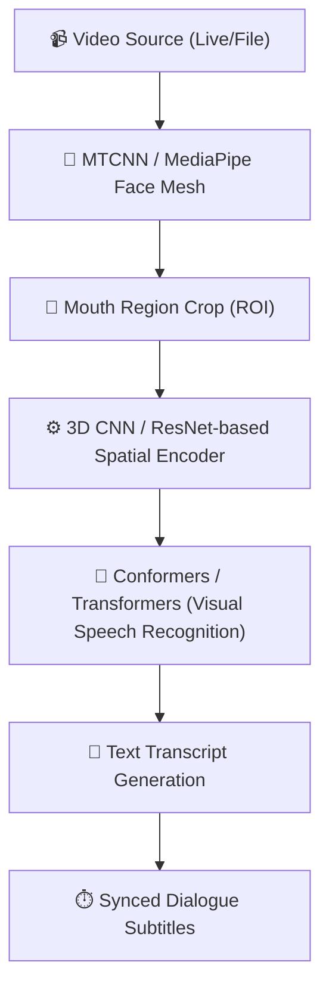

# 👄 AI Lip-Reading & Dialogue Reconstruction (Design Proposal)

## 🎯 Objective
Enable **autonomous dialogue extraction from silent or low-audio video** by tracking and transcribing lip movements (Visual Speech Recognition - VSR) in pre-recorded scenes or live video streams.

---

## 🏗️ Technical Pipeline

### 1. Pre-Processing & Face Landmark Tracking
* Use **MediaPipe Face Mesh** or **YOLOv8-face** to track facial landmarks in real-time.
* Isolate and crop the Mouth Region of Interest (ROI) into normalized $112 \times 112$ frame sequences.

### 2. Feature Extraction (Visual & Spatial-Temporal)
* Pass frame sequences through a **3D Convolutional Neural Network (3D CNN)** followed by a spatial-temporal encoder (e.g., **ResNet-18**) to capture mouth shapes, contours, and temporal speed.

### 3. Visual Speech Recognition (VSR)
* Route extracted temporal features into a **Conformer / Transformer sequence-to-sequence model** trained on lip-reading datasets (such as LRS3-TED or VoxCeleb2).
* The model decodes phonetic structures directly from visual sequences to generate text transcripts.

---

## ⚡ Live Stream (Real-Time) Architecture
For live production cameras or on-set feeds:
1. **WebRTC Ingestion:** Stream camera feeds via WebRTC to a GPU worker pool.
2. **Frame-Buffer Ingress:** Feed frame buffers directly to the VSR inference engine.
3. **Dialogue Streaming:** Stream transcribed words back to the production dashboard using **WebSockets** with sub-second latency.

---

## 💡 Practical Production Use Cases
* **Auditory Restoration:** Recover dialogue from old archive footage where the audio track is damaged or corrupted.
* **On-Set Script Verification:** Automatically verify that actors are speaking the correct dialogue in wide shots where the microphone is too far.
* **Silent Auditions:** Conduct remote or silent screen testing for actors.
