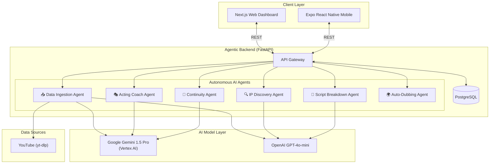

# AK Productions — Startup Pitch

  <strong>The AI-Native Film Studio</strong> 
  <em>From raw footage to production-ready screenplay in minutes, not months.</em>

---

## The Problem

The global film & television industry is worth **$370 billion**, yet its production workflows are stuck in the 1990s.

| Pain Point | Current Reality |
|---|---|
| **Script Formatting** | Writers manually transcribe and format dialogue from reference material — a process that takes days per episode. |
| **Multilingual Markets** | Pakistani, Indian, and Middle Eastern dramas are exploding globally, but there is no automated tool that structures dialogue across Urdu, Hindi, and English simultaneously. |
| **Continuity Errors** | Studios lose **$2M+ per production** on reshoots caused by missed continuity mistakes that a human script supervisor failed to catch. |
| **Actor Coaching** | Casting directors rely on subjective "gut feel" instead of data-driven performance metrics (pitch variance, emotional mapping, clarity). |
| **IP Discovery** | Finding forgotten intellectual properties ripe for modern remakes requires armies of researchers sifting through decades of archives. |

**There is no single platform that unifies these workflows under one AI-powered roof.**

---

## The Solution: AK Productions Studio OS

AK Productions is an **agentic AI platform** that orchestrates a network of specialized, autonomous AI agents to handle the entire film production lifecycle — from pre-production research to post-production dubbing.

Each agent is purpose-built for a specific stage of production and communicates through a shared PostgreSQL knowledge base.

### 🧠 Core Innovation: Multimodal Agentic Pipeline

Unlike simple chatbot wrappers, AK Productions agents are **autonomous, multimodal, and persistent**:

1. **They watch video.** Our Data Ingestion Engine downloads YouTube videos and feeds them directly into Google Gemini 1.5 Pro, which analyzes the visual scene topography, actor movements, and dialogue simultaneously.
2. **They listen to audio.** The Acting Coach agent processes raw `.wav` performance recordings, extracting pitch variance, emotional mapping, and clarity metrics.
3. **They read scripts.** The Script Breakdown agent parses uploaded PDFs to automatically extract cast requirements, props, wardrobe, and budget estimates.
4. **They remember everything.** All extracted data is persisted to PostgreSQL, creating a growing institutional knowledge base that every agent can query.

---

## Product Architecture

---

## Agent Capabilities

### 1. 📥 Data Ingestion Agent
> *"Paste a YouTube URL. Get a production-ready, trilingual screenplay."*

- Downloads video via `yt-dlp` with configurable duration limits.
- Extracts subtitles via YouTube Transcript API.
- Routes processing to **OpenAI GPT-4o-mini** (fast/cheap) or **Gemini 1.5 Pro** (deep multimodal) — user's choice from the UI.
- **Deep Video Analysis mode**: Uploads full MP4 to Gemini, which watches the video and extracts actor sequences with timestamps, scene topography, and camera angles.
- Outputs structured JSON with trilingual dialogue: **Urdu Script (اردو)**, **Roman Urdu**, and **English**.
- Persists all data to PostgreSQL for downstream agent consumption.

### 2. 🔍 IP Discovery Agent
> *"Find forgotten 1980s sci-fi IPs ripe for a modern remake."*

- User specifies genre + era.
- LLM generates curated pitches with modern twists, audience fit scores, and remake rationale.

### 3. 📄 Script Breakdown Agent
> *"Upload a PDF script. Get an automatic breakdown of cast, props, wardrobe, and budget."*

- Parses uploaded PDF screenplays.
- Extracts structured production requirements via LLM.

### 4. 🎭 Acting Coach Agent
> *"Upload an actor's audition tape. Get objective performance analytics."*

- Processes `.wav` audio files.
- Extracts pitch variance, tempo, clarity, and emotional mapping.
- Provides data-driven feedback scores for casting directors.

### 5. 🎯 Continuity Agent
> *"Upload two frames from different takes. Detect visual inconsistencies."*

- Uses computer vision to compare frames across scenes.
- Flags prop placement, lighting changes, and wardrobe mismatches.

### 6. 🌍 Auto-Dubbing Agent
> *"Transcribe, translate, and generate lip-synced audio in 50+ languages."*

- Automatic speech-to-text transcription.
- LLM-powered translation.
- Voice synthesis for foreign language dubbing.

---

## Tech Stack

| Layer | Technology | Why |
|---|---|---|
| **Web** | Next.js 16, React 19, Tailwind v4, Framer Motion | Server components, premium design system, physics-based animations |
| **Mobile** | Expo SDK 56, React Native, Moti | Cross-platform iOS/Android from a single codebase |
| **Backend** | FastAPI (Python), Pydantic | High-performance async API with strict type contracts |
| **Database** | PostgreSQL | Battle-tested relational persistence for structured screenplay data |
| **AI — Multimodal** | Google Gemini 1.5 Pro (Vertex AI) | 1M token context window, native video understanding, JSON mode |
| **AI — Text** | OpenAI GPT-4o-mini | Fast, cheap structured text generation for high-volume tasks |
| **Video Pipeline** | yt-dlp, YouTube Transcript API | Automated video downloading and subtitle extraction |
| **Infrastructure** | Google Cloud Platform (Vertex AI) | Enterprise-grade model serving via user's GCP project |

---

## Market Opportunity

| Segment | Size |
|---|---|
| Global Film & TV Production | **$370B** |
| AI in Media & Entertainment | **$14.8B** (2025) → **$99.4B** (2030) |
| South Asian OTT Content Market | **$3.7B** (fastest growing segment) |

### Why Now?

1. **Gemini 1.5 Pro** is the first commercially available LLM that can natively ingest an entire video file (up to 1 hour) and reason over visuals + audio + text simultaneously. This was impossible 12 months ago.
2. **South Asian content is exploding globally.** Pakistani dramas are trending on YouTube with 100M+ views per episode. Studios urgently need tools that work natively with Urdu, Hindi, and English.
3. **AI agent orchestration is mature.** Frameworks for multi-agent coordination have reached production quality, enabling us to build specialized agents that share a persistent knowledge base.

---

## Traction & Differentiation

| Metric | Status |
|---|---|
| Functional agents | **6** (Data Ingestion, IP Discovery, Script Breakdown, Acting Coach, Continuity, Auto-Dubbing) |
| AI model integrations | **2** (OpenAI + Google Gemini via Vertex AI) |
| Platforms | **3** (Web, iOS, Android) |
| Supported languages | **3** (Urdu Script, Roman Urdu, English) |
| Data persistence | PostgreSQL with full CRUD |
| Open-source | Yes |

### What makes us different from generic AI tools?

| Feature | ChatGPT / Generic AI | AK Productions |
|---|---|---|
| Video understanding | ❌ Text-only | ✅ Downloads & analyzes MP4 via Gemini |
| Trilingual screenplay output | ❌ | ✅ Urdu Script + Roman Urdu + English |
| Production-specific agents | ❌ General purpose | ✅ IP Discovery, Continuity, Acting Coach |
| Persistent knowledge base | ❌ Stateless | ✅ PostgreSQL-backed library |
| Model-agnostic | ❌ Locked to one vendor | ✅ Switch OpenAI ↔ Gemini from UI |

---

## The Team

**AK Productions** is built by a solo technical founder with deep expertise in full-stack development, AI systems, and the South Asian media industry.

---

## Roadmap

| Phase | Status | Description |
|---|---|---|
| Multi-agent architecture | ✅ Done | FastAPI + 6 specialized agents |
| YouTube ingestion pipeline | ✅ Done | yt-dlp + transcript extraction + LLM structuring |
| Gemini multimodal integration | ✅ Done | Video upload → Gemini 1.5 Pro → structured JSON |
| Model-agnostic UI controls | ✅ Done | Switch OpenAI ↔ Gemini + duration slider |
| PostgreSQL persistence + Library | ✅ Done | Full CRUD, searchable script library |
| Studio Script Viewer | ✅ Done | Split-screen: YouTube player + synced screenplay |
| Acting Coach v2 | 🔄 In Progress | Compare actor performance against extracted scripts |
| Batch ingestion | 📋 Planned | Ingest entire drama series (50+ episodes) in one click |
| Real-time collaboration | 📋 Planned | Multiple crew members annotating the same script |
| SaaS deployment | 📋 Planned | Cloud-hosted multi-tenant version |

---

## 🚀 Future Expansion Proposals

We are actively researching and designing state-of-the-art expansion capabilities for Studio OS:
1. **[AI Lip-Reading & Dialogue Reconstruction](./LIP_READING_PROPOSAL.md)**: Generate transcripts and synced dialogue tracks from actor lip movements in silent videos or live streams.
2. **[AI Music-to-Motion Dance Choreography](./DANCE_CHOREOGRAPHY_PROPOSAL.md)**: Automatically suggest dynamic dance choreographies matching any music track.

---

## Links

| Resource | URL |
|---|---|
| 🏠 Repository | [github.com/AK-Productions](https://github.com/) |
| 📖 README | [README.md](./README.md) |
| 👄 Lip-Reading Proposal | [LIP_READING_PROPOSAL.md](./LIP_READING_PROPOSAL.md) |
| 🕺 Dance Choreography Proposal | [DANCE_CHOREOGRAPHY_PROPOSAL.md](./DANCE_CHOREOGRAPHY_PROPOSAL.md) |
| 🎬 Demo Video | _Coming soon_ |

---

  <strong>AK Productions</strong> — Where AI meets cinema. 
  <em>Built with Gemini 1.5 Pro, OpenAI, FastAPI, Next.js, and PostgreSQL.</em>

