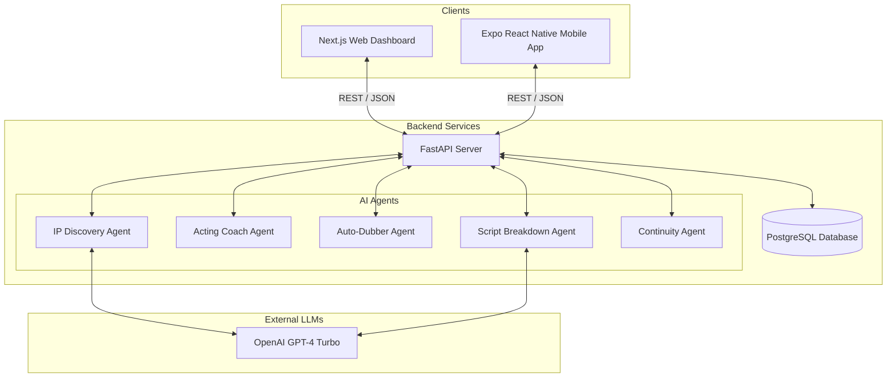
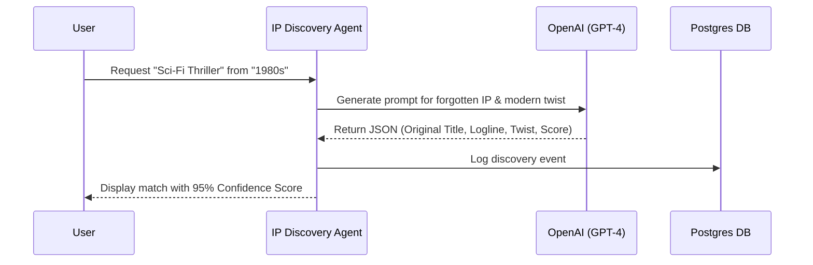
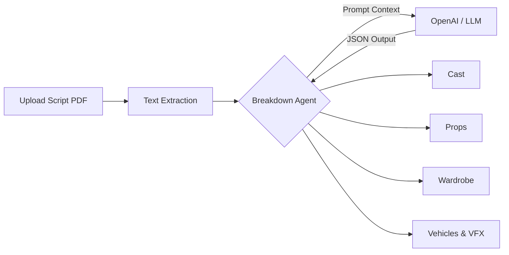
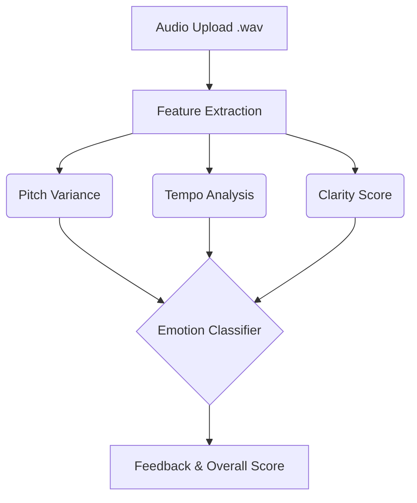

# AK_Productions Studio OS 🎬

A next-generation, premium-grade AI orchestration platform for film and television production. AK_Productions unifies the entire lifecycle of pre-production, production, and post-production into a single, cohesive ecosystem powered by advanced AI models.

## 🏗 System Architecture

The platform operates as a monorepo consisting of three distinct layers:

## 🛠 Tech Stack

The architecture is built on a modern, high-performance stack designed for scale and premium UX:

### Web Dashboard (Next.js)
- **Framework**: Next.js 16 (React 19)
- **Styling**: TailwindCSS v4 with custom Glassmorphism/Neon design system
- **Animations**: Framer Motion (Physics-based staggered layout animations)
- **Iconography**: Lucide React

### Mobile Application (Expo / React Native)
- **Framework**: Expo SDK 56 (React Native)
- **Routing**: Expo Router (File-based routing)
- **Native Animations**: React Native Reanimated & Moti
- **Iconography**: Lucide React Native
- **Styling**: Native StyleSheet & Expo Blur (for glass effects)

### Backend Services (Python)
- **Framework**: FastAPI (High-performance async Python API)
- **Database**: PostgreSQL (Relational persistence layer)
- **Validation**: Pydantic (Strongly-typed data contracts)

### Artificial Intelligence
- **LLM Engine**: OpenAI GPT-4 Turbo
- **Agentic Framework**: Custom Python orchestration for structured JSON generation
- **Data Modalities**: Text processing, Audio (Prosody/Pitch), & Computer Vision (Continuity)

## 🤖 AI Agent Modules

The platform is designed around 5 core AI agents. Below are the detailed internal architectures for the primary agents.

### 1. IP Discovery (Pre-Production)
Scans historical databases to find forgotten IPs that match modern trends. Integrates with OpenAI to generate modern loglines and twists.

### 2. Script Breakdown (Pre-Production)
Parses PDF scripts to automatically extract casting requirements, props, wardrobe, and estimated budgets. 

### 3. Acting Coach (Casting)
Analyzes audio files of actor performances, providing emotion mapping, pitch variance, and clarity scores.

### 4. Continuity Agent (Production)
Uses computer vision to analyze frames across scenes, ensuring props, lighting, and wardrobe remain consistent.

### 5. Auto-Dubbing (Post-Production)
Transcribes, translates, and generates lip-synced audio clones in foreign languages for global distribution.

## 🚀 Getting Started

Ensure you have Node.js, Python 3.14+, and PostgreSQL installed on your machine.

### 1. Backend Setup
1. Navigate to the backend directory: `cd backend`
2. Create your `.env` file and add your `DATABASE_URL` and `OPENAI_API_KEY`.
3. Install dependencies: `pip install -r requirements.txt`
4. Start the server: `uvicorn main:app --reload`

### 2. Web Dashboard Setup
1. Navigate to the frontend directory: `cd frontend`
2. Install dependencies: `npm install`
3. Run the development server: `npm run dev`
4. Open [http://localhost:3000](http://localhost:3000)

### 3. Mobile App Setup
1. Navigate to the mobile directory: `cd mobile_app`
2. Install dependencies: `npm install`
3. Launch the Expo bundler: `npx expo start`
4. Run on an emulator using `npm run android` or `npm run ios`.

## 🎨 Design System
The frontend and mobile applications share a unified design language centered around **Glassmorphism**, featuring dark neon cinematic accents (`#020617` backgrounds with `#22d3ee` and `#c084fc` neon highlights) to provide a premium, state-of-the-art experience.
